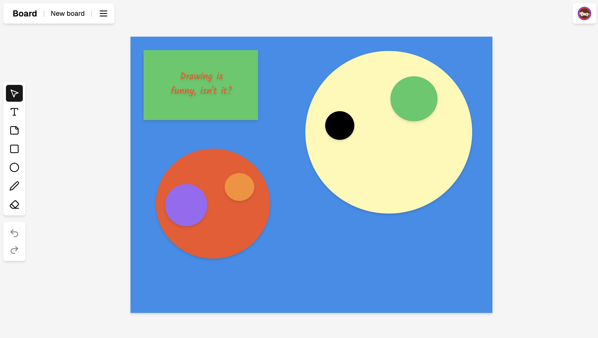

<a href="#">
  
  <h1 align="center">Miro-board</h1>
</a>

<p align="center">
  A modern collaborative Miro-clone built with Next.js 14, Clerk, and Liveblock.
</p>

<p align="center">
  <a href="#features"><strong>Features</strong></a> ·
  <a href="#collaboration-features"><strong>Collaboration Features</strong></a> ·
  <a href="#deploy-your-own"><strong>Deploy Your Own</strong></a> ·
  <a href="#running-locally"><strong>Running locally</strong></a>
</p>
<br/>

## Features

- [Next.js](https://nextjs.org) App Router
  - Advanced routing for seamless navigation and performance
  - React Server Components (RSCs) and Server Actions for server-side rendering
  - Optimized static and dynamic content delivery
- [Clerk Authentication](https://clerk.com)
  - Secure user authentication and management
  - Protected routes and middleware integration
  - Social login options and user profiles
- [Liveblocks](https://liveblocks.io)
  - Real-time collaboration with presence awareness
  - Cursor tracking and live updates
  - Conflict-free state management
- Modern UI/UX
  - Beautiful design with [Tailwind CSS](https://tailwindcss.com)
  - Interactive canvas with custom tools
  - Responsive and accessible interface

## Collaboration Features

This app ships with [Liveblocks](https://liveblocks.io) as the real-time collaboration engine. Key features include:

- Real-time cursor presence for all connected users
- Collaborative drawing and editing tools
- Shared whiteboard state synchronization
- Multiple users can work simultaneously
- Changes are reflected instantly across all connected clients

## Deploy Your Own

You can deploy your own version of Miro-board to Vercel with one click:

[](https://vercel.com/new/clone?repository-url=https%3A%2F%2Fgithub.com%2Fyourusername%2Fmiro-board&env=NEXT_PUBLIC_CLERK_PUBLISHABLE_KEY,CLERK_SECRET_KEY,LIVEBLOCKS_SECRET_KEY&envDescription=Learn%20more%20about%20how%20to%20get%20the%20API%20Keys%20for%20the%20application&envLink=https%3A%2F%2Fgithub.com%2Fyourusername%2Fmiro-board%2Fblob%2Fmain%2F.env.example&demo-title=Miro-board&demo-description=A%20modern%20collaborative%20whiteboard%20platform%20built%20with%20Next.js%2014%2C%20Clerk%2C%20and%20Liveblock&demo-url=https%3A%2F%2Fmiro-board-demo.vercel.app)

## Running locally

You will need to use the environment variables [defined in `.env.example`](.env.example) to run Miro-board. It's recommended you use [Vercel Environment Variables](https://vercel.com/docs/projects/environment-variables) for this, but a `.env` file is all that is necessary.

> Note: You should not commit your `.env` file or it will expose secrets that will allow others to control access to your various authentication and collaboration provider accounts.

1. Install Vercel CLI: `npm i -g vercel`
2. Link local instance with Vercel and GitHub accounts (creates `.vercel` directory): `vercel link`
3. Download your environment variables: `vercel env pull`

```bash
bun install
bun dev
```

Your app should now be running on [localhost:3000](http://localhost:3000/).

## Learn More

To learn more about the technologies used in this project:

- [Next.js Documentation](https://nextjs.org/docs)
- [Clerk Documentation](https://clerk.com/docs)
- [Liveblocks Documentation](https://liveblocks.io/docs)
- [Tailwind CSS Documentation](https://tailwindcss.com/docs)
